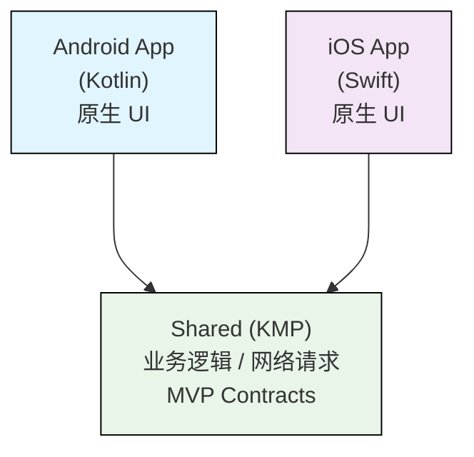

# WxPusher 客户端

WxPusher 是一个使用微信公众号作为通道的，实时信息推送平台。本仓库为 WxPusher 的移动客户端项目，使用 **Kotlin Multiplatform (KMP)** 共享业务逻辑，搭配 **Android (Kotlin)** 和 **iOS (Swift)** 原生 UI 实现。

📖 完整的平台文档请参阅：[WxPusher 官方文档](https://wxpusher.zjiecode.com/docs/) | 📥 [下载最新版本 APP](https://wxpusher.zjiecode.com/docs/download.html)

---

## 功能特性

- **消息推送**：接收来自 WxPusher 平台的实时消息推送
- **多通道推送**（Android）：支持华为、荣耀、小米、vivo、OPPO、魅族厂商推送通道及自建 WebSocket 长连接通道
- **微信登录**：通过微信 SDK 实现快捷登录
- **二维码扫描**：扫码关注 Topic、绑定账号等
- **账号管理**：登录、注册、绑定手机、换绑手机
- **消息列表**：浏览和管理推送消息，支持下拉刷新
- **订阅管理**：查看和管理已订阅的 Topic（发送方）列表
- **WebView**：内嵌网页查看消息详情

---

## 技术架构

本项目采用 **KMP + 原生 UI** 的混合架构：



- **Shared 层**：使用 KMP 编写跨平台业务逻辑，采用 **MVP 架构模式**（Contract + Presenter），通过 Ktor 进行网络请求
- **Android 层**：使用 Kotlin 开发原生 Android UI（Activity / Fragment），集成多厂商推送 SDK
- **iOS 层**：使用 Swift 开发原生 iOS UI（UIKit），通过 CocoaPods 集成 KMP Shared Framework

---

## 项目管理
| 分支名                    | 用途说明                                                                                                       |
|--------------------------|----------------------------------------------------------------------------------------------------------------|
| **master**               | 保存最新 WxPusher 官方线上发布版本                                                                              |
| **release**              | 保存即将发布的下一个版本。新开发的 Feature 可 PR 到 release 分支，release 分支发布后会合并到 master 分支         |
| **unofficial_custom/xxx**| 非官方定制版本。社区用户如需开发不合并至官方主线的功能，可拉出非官方定制分支并合并到该分支进行打包           |

> **贡献代码请提交 PR 到 `release` 分支**，而非 `master` 分支。`release` 分支经过测试验证后，会合并到 `master` 并发布新版本。


因为WxPusher对接了很多Android系统推送通道，但是部分厂商对应用的包名、签名会有要求，因此**开发者想要使用系统推送功能，必须要使用WxPusher官方的包名和签名构建安装包**。

一般的开发流程如下：
1. 确定开发的feature是否需要合并到WxPusher主线release分支，开发前可以联系WxPusher客服沟通（微信：lanyunt）；
1. 确定开发需求可以合并到主线，fork仓库，从release拉出分支，开发完成后提PR合并到release分支；
1. 如果开发的需求不合并到主线，联系WxPusher客服（微信：lanyunt）帮你拉出unofficial_custom/xxx的非官方定制版本，fork仓库开发后，PR到unofficial_custom/xxx分支;

代码合并到master/release/unofficial_custom 分支，**Github Action会自动使用正式签名构建APK，iOS会上传到TestFlight**，你可以直接下载apk或者从TestFlight下载正式包进行测试使用了。

你可以使用如下链接，加入到[WxPusher非官方版本](https://testflight.apple.com/join/zav17bJR)TF测试组(https://testflight.apple.com/join/zav17bJR)，Github Action构建的iOS包会自动加入到TF里面，你可以通过TF下载安装和使用
> 需要注意，有一定延迟，PR完成后，构建需要10分钟左右，上传到TF上，一般半个小时左右会显示出来，如有问题，可以联系官方客服（微信：lanyunt）

## 项目结构

```
WxPusher-App/
├── shared/                          # KMP 跨平台共享模块
│   └── src/
│       ├── commonMain/              # 通用业务逻辑（Kotlin）
│       │   └── kotlin/.../kmp/
│       │       ├── api/             # API 网络请求层
│       │       ├── base/            # 基础类和工具
│       │       │   ├── biz/         # 业务基础逻辑
│       │       │   └── common/      # 通用工具类
│       │       └── page/            # 页面 MVP Contract & Presenter
│       │           ├── login/           # 登录
│       │           ├── messagelist/     # 消息列表
│       │           ├── providerlist/    # 订阅列表
│       │           ├── accountdetail/   # 账号详情
│       │           ├── bind/            # 绑定手机
│       │           ├── changephone/     # 换绑手机
│       │           ├── registerorbind/  # 注册或绑定
│       │           ├── scan/            # 扫码
│       │           └── unbind/          # 解绑
│       ├── androidMain/             # Android 平台特定实现
│       └── iosMain/                 # iOS 平台特定实现 + cinterop 桥接
│
├── androidApp/                      # Android 原生应用（Kotlin）
│   └── src/
│       ├── androidMain/             # 主代码
│       │   └── kotlin/.../wxpusher/
│       │       ├── app/             # Application 入口
│       │       ├── page/            # 页面（Activity / Fragment）
│       │       │   ├── main/            # 主页（Tab 导航）
│       │       │   ├── login/           # 登录页
│       │       │   ├── scan/            # 扫码页
│       │       │   ├── accountdetail/   # 账号详情页
│       │       │   ├── bind/            # 绑定手机页
│       │       │   ├── changephone/     # 换绑手机页
│       │       │   ├── registerorbind/  # 注册或绑定页
│       │       │   ├── web/             # WebView 页
│       │       │   └── useragreement/   # 用户协议页
│       │       ├── push/            # 推送通道实现
│       │       │   ├── huawei/          # 华为推送
│       │       │   ├── honor/           # 荣耀推送
│       │       │   ├── xiaomi/          # 小米推送
│       │       │   ├── vivo/            # vivo 推送
│       │       │   ├── oppo/            # OPPO 推送
│       │       │   ├── meizu/           # 魅族推送
│       │       │   └── ws/              # WebSocket 自建通道
│       │       ├── wxapi/           # 微信 SDK 集成
│       │       ├── utils/           # 工具类
│       │       ├── config/          # 配置
│       │       ├── dialog/          # 弹窗
│       │       ├── bean/            # 数据模型
│       │       ├── base/            # 基础类
│       │       └── common/          # 通用组件
│       ├── androidOffline/          # 测试环境 Flavor
│       └── androidProd/             # 生产环境 Flavor
│
├── iosApp/                          # iOS 原生应用（Swift）
│   ├── wxpusher/                    # Xcode 工程
│   │   ├── WxPusher-iOS/           # iOS App Target
│   │   ├── WxPusher-Mac/           # macOS App Target
│   │   ├── Page/                   # 页面（ViewController）
│   │   │   ├── Main/                   # 主页（TabBar）
│   │   │   ├── Login/                  # 登录页
│   │   │   ├── MessageList/            # 消息列表页
│   │   │   ├── ProviderList/           # 订阅列表页
│   │   │   ├── AccountDetail/          # 账号详情页
│   │   │   ├── QRCodeScan/             # 扫码页
│   │   │   ├── RegisterOrBind/         # 注册或绑定页
│   │   │   ├── BindPhone/              # 绑定手机页
│   │   │   ├── ChangePhone/            # 换绑手机页
│   │   │   ├── Profile/                # 个人信息页
│   │   │   ├── WebView/                # WebView 页
│   │   │   ├── Weixin/                 # 微信相关
│   │   │   ├── UserAgreement/          # 用户协议页
│   │   │   └── Base/                   # 基础 ViewController
│   │   ├── Common/                 # 通用工具和服务
│   │   └── KtSwiftBridge/          # Kotlin-Swift 互操作桥接
│   ├── Podfile                     # CocoaPods 依赖管理
│   └── wxpusher.xcworkspace        # Xcode Workspace
│
├── gradle/                          # Gradle Wrapper & 版本目录
│   └── libs.versions.toml          # 依赖版本统一管理
├── build.gradle.kts                 # 根构建脚本
├── settings.gradle.kts              # 项目配置
├── LICENSE                          # 开源协议（中文）
└── LICENSE_EN                       # 开源协议（英文）
```

---

## 技术栈

### 跨平台共享（Shared）

| 技术 | 版本 | 用途 |
|------|------|------|
| Kotlin Multiplatform | 2.x | 跨平台业务逻辑共享 |
| Ktor Client | 3.2.1 | 网络请求（HTTP 客户端） |
| Kotlinx Coroutines | 1.10.2 | 协程异步编程 |
| Kotlinx Serialization | - | JSON 序列化/反序列化 |
| Kotlinx DateTime | 0.6.1 | 跨平台日期时间处理 |

### Android

| 技术 | 版本 | 用途 |
|------|------|------|
| Kotlin | - | 开发语言 |
| AndroidX Core KTX | 1.15.0 | Android 核心扩展 |
| AndroidX AppCompat | 1.7.0 | 向后兼容 |
| Material Design | 1.12.0 | UI 组件库 |
| AndroidX Lifecycle | 2.8.3 | 生命周期管理 |
| WorkManager | 2.10.0 | 后台任务 |
| OkHttp | 4.12.0 | HTTP 客户端 |
| Gson | 2.10.1 | JSON 解析 |
| ZXing | 3.3.3 | 二维码扫描 |
| SmartRefreshLayout | 2.1.0 | 下拉刷新 |
| WeChat SDK | 6.8.34 | 微信登录 |
| 华为 Push SDK | 6.13.0.300 | 华为推送通道 |
| 荣耀 Push SDK | 8.0.12.307 | 荣耀推送通道 |

### iOS

| 技术 | 版本 | 用途 |
|------|------|------|
| Swift | 5.0+ | 开发语言 |
| UIKit | - | 原生 UI 框架 |
| CocoaPods | - | 依赖管理 |
| MJRefresh | 3.7.9 | 下拉刷新 |
| Toaster | 2.3.0 | Toast 提示 |
| WechatOpenSDK | 2.0.5 | 微信登录 |

---

## 环境要求

### 通用

- **JDK** 11+
- **Gradle** 8.5+（项目自带 Gradle Wrapper）

### Android 开发

- **Android Studio** Ladybug (2024.2) 或更高版本
- **Android SDK**：compileSdk 35，minSdk 26，targetSdk 34
- **Kotlin** 插件已安装

### iOS 开发

- **macOS** 系统
- **Xcode** 15.0+
- **CocoaPods** 1.14+（`sudo gem install cocoapods`）
- iOS Deployment Target：14.0+

---

## 快速开始

### 克隆项目

```bash
git clone https://github.com/wxpusher/WxPusher-App.git
cd WxPusher-App
```

### 构建 Android

1. 使用 **Android Studio** 打开项目根目录
2. 等待 Gradle Sync 完成
3. 选择 Build Variant：
   - `androidOffline`：测试环境
   - `androidProd`：生产环境
4. 运行 `androidApp` 模块

```bash
# 或使用命令行构建
./gradlew :androidApp:assembleAndroidProdDebug
```

### 构建 iOS

1. 安装 CocoaPods 依赖：

```bash
cd iosApp
pod install
```

2. 使用 **Xcode** 打开 `iosApp/wxpusher.xcworkspace`（注意是 `.xcworkspace` 而非 `.xcodeproj`）
3. 选择目标设备，运行 `WxPusher-iOS` Target

> **注意**：首次构建前需先执行 `pod install`，确保 shared framework 和第三方依赖正确集成。

---

## 架构说明

### MVP 模式（Shared 层）

项目在 Shared 层采用 **MVP（Model-View-Presenter）** 架构：

- **Contract**：定义 View 接口和 Presenter 接口，规范页面交互契约
- **Presenter**：实现业务逻辑，通过 Ktor 调用后端 API，处理数据并回调 View
- **View**：由各平台原生代码实现（Android Activity/Fragment、iOS ViewController）

```
Contract (commonMain)
├── IXxxView        # View 接口
└── IXxxPresenter   # Presenter 接口

Presenter (commonMain)
└── XxxPresenter    # 业务逻辑实现

View (平台原生)
├── Android: XxxActivity / XxxFragment
└── iOS: XxxViewController
```

### 推送架构（Android）

Android 端集成了多家厂商系统推送通道，通过统一的推送管理层实现分发，可以让APP不保持后台运行，接收消息推送。

*需要注意，部分厂商会绑定签名和包名，修改包名和签名后，可能无法接收推送通知*

| 通道 | 适用设备 | 说明 |
|------|----------|------|
| 华为 Push | 华为/荣耀设备 | HMS Core 推送 |
| 荣耀 Push | 荣耀设备 | 荣耀独立推送 |
| 小米 Push | 小米/Redmi 设备 | MiPush |
| vivo Push | vivo/iQOO 设备 | vivo 推送 |
| OPPO Push | OPPO/Realme/一加 设备 | OPPO 推送 |
| 魅族 Push | 魅族设备 | Flyme 推送 |
| WebSocket | 所有设备 | 自建长连接通道（兜底方案） |

### Kotlin-Swift 互操作

iOS 端通过 **cinterop** 机制桥接 Kotlin 与 Swift 代码，桥接头文件位于 `iosApp/wxpusher/KtSwiftBridge/` 目录。

---

## 贡献指南

欢迎对 WxPusher 客户端项目进行贡献！请遵循以下流程：

### 1. Fork & Clone

```bash
# Fork 本仓库后克隆到本地
git clone https://github.com/<your-username>/WxPusher-App.git
cd WxPusher-App
```

### 2. 基于 release 分支创建开发分支

```bash
git checkout release
git pull origin release
git checkout -b feature/your-feature-name
```

### 3. 开发和提交

- 遵循现有的代码风格和项目结构
- Shared 层的改动需同时在 Android 和 iOS 上验证
- 提交信息请使用清晰的描述，说明改动内容和原因

```bash
git add .
git commit -m "feat: 添加xxx功能"
git push origin feature/your-feature-name
```

### 4. 提交 Pull Request

- 在 GitHub 上创建 Pull Request，**目标分支选择 `release`**
- 描述你的改动内容和测试情况
- 等待代码审查和合并

### 注意事项

- 提交的贡献代码需遵守本项目的[开源协议](#开源协议)
- 请勿提交包含敏感信息的文件（API Key、签名文件等）
- 涉及厂商推送通道的改动，请确保在对应设备上测试通过

---

## 开源协议

本项目采用 **四川思明今创科技有限公司客户端开源协议**，主要条款如下：

- ✅ 可自由查看和审计全部源代码
- ✅ 可修改和编译用于个人/内部非商业用途
- ✅ 可向本项目提交代码贡献
- ✅ 可正常传播分发官方未修改版本
- ❌ 不得用于商业盈利活动
- ❌ 不得分发修改后的非官方版本
- ❌ 不得基于本项目开发竞品进行商业化

完整协议请参阅 [LICENSE](./LICENSE)（中文）/ [LICENSE_EN](./LICENSE_EN)（英文）。

---

## 下载安装

前往 [WxPusher APP 下载页](https://wxpusher.zjiecode.com/docs/download.html) 获取最新版本：

- **Android**：直接下载 APK 安装
- **iOS**：扫码下载或在 App Store 搜索「WxPusher消息推送平台」

---

## 相关链接

- [WxPusher 官方文档](https://wxpusher.zjiecode.com/docs/)
- [WxPusher 官网](https://wxpusher.zjiecode.com)
- [APP 下载](https://wxpusher.zjiecode.com/docs/download.html)
